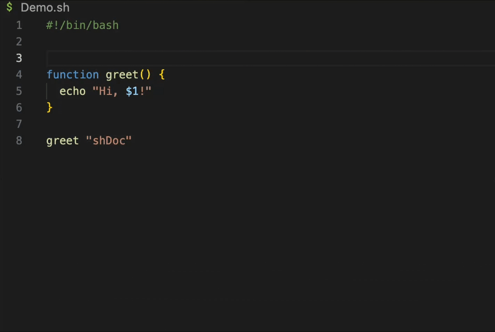

# shDoc



#### **✨ Adding intelligence to your shell scripts** — An API documentation standard/generator for Shell.

💡 Bring the power, structure, and autocomplete of modern JavaScript documentation to your bash environment.  
🛑 Stop guessing what your shell functions do; ✅ Start documenting them properly.

## Getting Started

Install `shDoc` via Visual Studio Code extensions marketplace.

or manually install `shDoc` in the following steps:

1\. Download `shdoc-<version>.vsix` from our [Latest Release](https://github.com/dawsonhuang0/shDoc/releases).

2\. Run the following command to install:
```bash
code --install-extension shdoc-<version>.vsix
```

## Usage

`shDoc` brings the familiarity of JSDoc to the world of Shell Scripting.

**Opening:** Use `###` (equivalent to `/**`)  
**Closing:** Use `##` (equivalent to `*/`)

### Variable/Function Documentation

Place the block directly above your variable/function to enable hover intelligence and symbol tracking:

```bash
###
 # Example Doc.
 # 
 # @param $1 - I'm a param.
 ##
function example() {
  echo "$1"
}
```

### ✨ Script Headers (sheDoc)

Use the `###!` opening at the very top of your script (under the shebang) for global metadata:

```bash
#!/bin/bash
###!
 # This script is for example.
 # 
 # @author Example <shebang@example.com>
 ##
```

**High Completion:** Tags like *@param* and *@author* follow JSDoc standards. `shDoc` provides autocomplete for all *84+* JSDoc tags out of the box, ensuring every detail of your script is documented.

## Feedback

**Found a bug?** Feel free to [open an issue](https://github.com/dawsonhuang0/shDoc/issues/new?labels=bug).  
**New tag/feature idea?** Don't hesitate to [share it with us](https://github.com/dawsonhuang0/shDoc/issues/new?labels=new%20feature).

## Acknowledgments

- [JSDoc](https://jsdoc.app): For providing the gold standard of documentation syntax that inspired this project.

## License

Distributed under the MIT License.  
See [`LICENSE`](LICENSE) for more information.
